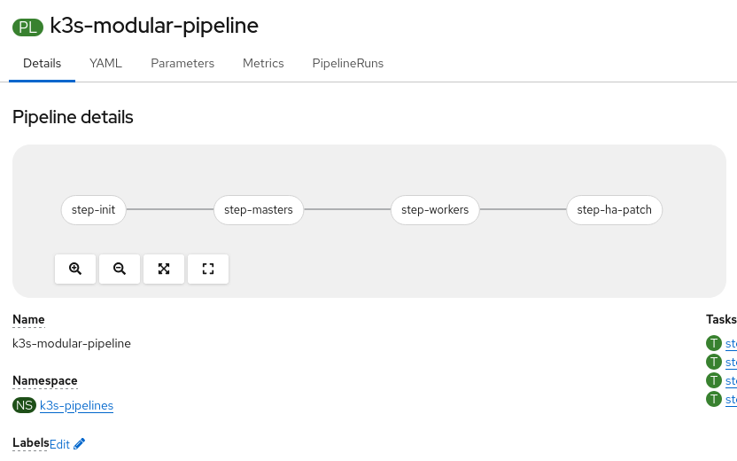
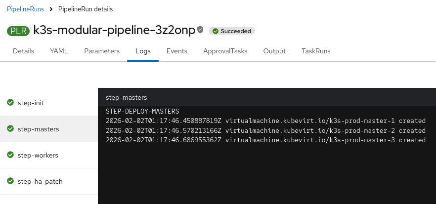
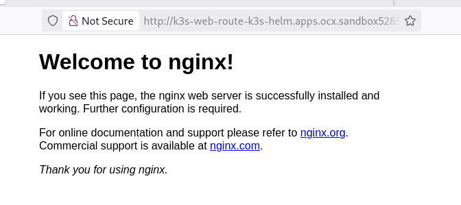

```
# Force delete previous project and wait for a clean state
oc delete project k3s-pipelines --ignore-not-found --wait=true

cat <<EOF | oc apply -f -
---
apiVersion: v1
kind: Namespace
metadata:
  name: k3s-pipelines
---
apiVersion: rbac.authorization.k8s.io/v1
kind: ClusterRoleBinding
metadata:
  name: k3s-pipeline-admin-binding
roleRef:
  apiGroup: rbac.authorization.k8s.io
  kind: ClusterRole
  name: cluster-admin
subjects:
  - kind: ServiceAccount
    name: pipeline
    namespace: k3s-pipelines
---
# TASK 1: VALIDATION AND NETWORKING
apiVersion: tekton.dev/v1beta1
kind: Task
metadata:
  name: k3s-init-task
  namespace: k3s-pipelines
spec:
  params:
    - name: clusterName
      type: string
    - name: workerCount
      type: string
  steps:
    - name: validate-and-network
      image: quay.io/openshift/origin-cli:latest
      script: |
        #!/bin/bash
        W_VAL=\$(params.workerCount)
        if [ "\$W_VAL" -lt 1 ] || [ "\$W_VAL" -gt 5 ]; then
          echo "VALIDATION ERROR: Worker count must be 1-5."
          exit 1
        fi
        
        C_NAME=\$(params.clusterName)
        BASE_DOMAIN=\$(oc get ingress.config.openshift.io cluster -o jsonpath='{.spec.domain}')
        
        cat <<EOT | oc apply -f -
        apiVersion: v1
        kind: Service
        metadata: { name: k3s-api-lb, namespace: k3s-pipelines }
        spec:
          selector: { k3s-role: bootstrap, app: k3s-master }
          ports: [{ name: https, protocol: TCP, port: 6443, targetPort: 6443 }]
        ---
        apiVersion: route.openshift.io/v1
        kind: Route
        metadata: { name: k3s-api-route, namespace: k3s-pipelines }
        spec:
          host: \$C_NAME.\$BASE_DOMAIN
          to: { kind: Service, name: k3s-api-lb }
          tls: { termination: passthrough }
        EOT
---
# TASK 2: DEPLOY MASTERS
apiVersion: tekton.dev/v1beta1
kind: Task
metadata:
  name: k3s-master-task
  namespace: k3s-pipelines
spec:
  params:
    - name: clusterName
      type: string
  steps:
    - name: deploy-masters
      image: quay.io/openshift/origin-cli:latest
      script: |
        #!/bin/bash
        C_NAME=\$(params.clusterName)
        BASE_DOMAIN=\$(oc get ingress.config.openshift.io cluster -o jsonpath='{.spec.domain}')
        TOKEN="SecretToken123"
        STORAGE="ocs-storagecluster-ceph-rbd-virtualization"

        for i in {1..3}; do
          ROLE="follower"
          CMD="until curl -sk https://k3s-api-lb.k3s-pipelines.svc.cluster.local:6443/ping; do sleep 10; done; curl -sfL https://get.k3s.io | K3S_TOKEN=\$TOKEN sh -s - server --server https://k3s-api-lb.k3s-pipelines.svc.cluster.local:6443"
          if [ "\$i" -eq 1 ]; then
            ROLE="bootstrap"
            CMD="curl -sfL https://get.k3s.io | K3S_TOKEN=\$TOKEN sh -s - server --cluster-init --tls-san \$C_NAME.\$BASE_DOMAIN"
          fi

          cat <<EOT | oc apply -f -
        apiVersion: kubevirt.io/v1
        kind: VirtualMachine
        metadata:
          name: \$C_NAME-master-\$i
          namespace: k3s-pipelines
          labels: { app: k3s-master, k3s-role: \$ROLE }
        spec:
          runStrategy: Always
          template:
            metadata: { labels: { app: k3s-master, k3s-role: \$ROLE } }
            spec:
              domain:
                cpu: { cores: 2 }
                resources: { requests: { memory: 4Gi } }
                devices:
                  interfaces: [{ name: default, bridge: {} }]
                  disks: [{ name: rootdisk, disk: { bus: virtio } }, { name: cloudinit, disk: { bus: virtio } }]
              networks: [{ name: default, pod: {} }]
              volumes:
                - name: rootdisk
                  dataVolume: { name: \$C_NAME-master-\$i-dv }
                - name: cloudinit
                  cloudInitNoCloud:
                    userData: |
                      #cloud-config
                      user: fedora
                      password: 'password123'
                      chpasswd: { expire: False }
                      ssh_pwauth: True
                      runcmd:
                        - chage -m 0 -M 99999 -I -1 -E -1 fedora
                        - dnf install -y iptables iptables-services
                        - \$CMD
          dataVolumeTemplates:
            - metadata: { name: \$C_NAME-master-\$i-dv }
              spec:
                source: { registry: { url: "docker://quay.io/containerdisks/fedora:40" } }
                storage: { resources: { requests: { storage: 20Gi } }, storageClassName: \$STORAGE }
        EOT
        done
---
# TASK 3: DEPLOY WORKERS
apiVersion: tekton.dev/v1beta1
kind: Task
metadata:
  name: k3s-worker-task
  namespace: k3s-pipelines
spec:
  params:
    - name: clusterName
      type: string
    - name: workerCount
      type: string
  steps:
    - name: deploy-workers
      image: quay.io/openshift/origin-cli:latest
      script: |
        #!/bin/bash
        C_NAME=\$(params.clusterName)
        TOKEN="SecretToken123"
        STORAGE="ocs-storagecluster-ceph-rbd-virtualization"

        for i in \$(seq 1 \$(params.workerCount)); do
          cat <<EOT | oc apply -f -
        apiVersion: kubevirt.io/v1
        kind: VirtualMachine
        metadata:
          name: \$C_NAME-worker-\$i
          namespace: k3s-pipelines
          labels: { app: k3s-worker }
        spec:
          runStrategy: Always
          template:
            metadata: { labels: { app: k3s-worker } }
            spec:
              domain:
                cpu: { cores: 2 }
                resources: { requests: { memory: 4Gi } }
                devices:
                  interfaces: [{ name: default, bridge: {} }]
                  disks: [{ name: rootdisk, disk: { bus: virtio } }, { name: cloudinit, disk: { bus: virtio } }]
              networks: [{ name: default, pod: {} }]
              volumes:
                - name: rootdisk
                  dataVolume: { name: \$C_NAME-worker-\$i-dv }
                - name: cloudinit
                  cloudInitNoCloud:
                    userData: |
                      #cloud-config
                      user: fedora
                      password: 'password123'
                      chpasswd: { expire: False }
                      ssh_pwauth: True
                      runcmd:
                        - chage -m 0 -M 99999 -I -1 -E -1 fedora
                        - dnf install -y iptables
                        - until curl -sk https://k3s-api-lb.k3s-pipelines.svc.cluster.local:6443/ping; do sleep 10; done
                        - curl -sfL https://get.k3s.io | K3S_TOKEN=\$TOKEN K3S_URL=https://k3s-api-lb.k3s-pipelines.svc.cluster.local:6443 sh -s - agent
          dataVolumeTemplates:
            - metadata: { name: \$C_NAME-worker-\$i-dv }
              spec:
                source: { registry: { url: "docker://quay.io/containerdisks/fedora:40" } }
                storage: { resources: { requests: { storage: 20Gi } }, storageClassName: \$STORAGE }
        EOT
        done
---
# TASK 4: ENABLE HA (SERVICE PATCH)
apiVersion: tekton.dev/v1beta1
kind: Task
metadata:
  name: k3s-ha-patch-task
  namespace: k3s-pipelines
spec:
  steps:
    - name: patch-service
      image: quay.io/openshift/origin-cli:latest
      script: |
        #!/bin/bash
        echo "Waiting for Cluster Stability..."
        sleep 240
        oc patch svc k3s-api-lb -n k3s-pipelines --type='merge' -p '{"spec":{"selector":{"app":"k3s-master","k3s-role":null}}}'
---
# MODULAR PIPELINE DEFINITION
apiVersion: tekton.dev/v1beta1
kind: Pipeline
metadata:
  name: k3s-modular-pipeline
  namespace: k3s-pipelines
spec:
  params:
    - name: CLUSTER_NAME
      type: string
      default: "k3s-prod"
      description: "Prefix for VMs and Route"
    - name: WORKER_COUNT
      type: string
      default: "2"
      description: "Number of workers (Range: 1 to 5)"
  tasks:
    - name: step-init
      taskRef: { name: k3s-init-task }
      params:
        - name: clusterName
          value: \$(params.CLUSTER_NAME)
        - name: workerCount
          value: \$(params.WORKER_COUNT)
    - name: step-masters
      runAfter: [step-init]
      taskRef: { name: k3s-master-task }
      params:
        - name: clusterName
          value: \$(params.CLUSTER_NAME)
    - name: step-workers
      runAfter: [step-masters]
      taskRef: { name: k3s-worker-task }
      params:
        - name: clusterName
          value: \$(params.CLUSTER_NAME)
        - name: workerCount
          value: \$(params.WORKER_COUNT)
    - name: step-ha-patch
      runAfter: [step-workers]
      taskRef: { name: k3s-ha-patch-task }
EOF
```

## Pipeline form <br>


## Pipeline  <br>


## Pipeline run <br>



### CHECK CREATED RESOURCES
```
[bulut@t490s tmp]$ oc get vms
NAME                AGE   STATUS    READY
k3s-prod-master-1   12m   Running   True
k3s-prod-master-2   12m   Running   True
k3s-prod-master-3   12m   Running   True
k3s-prod-worker-1   11m   Running   True
k3s-prod-worker-2   11m   Running   True
[bulut@t490s tmp]$ oc get vmis
NAME                AGE   PHASE     IP             NODENAME                                    READY
k3s-prod-master-1   11m   Running   10.131.0.251   ip-10-0-26-191.us-east-2.compute.internal   True
k3s-prod-master-2   11m   Running   10.131.0.249   ip-10-0-26-191.us-east-2.compute.internal   True
k3s-prod-master-3   11m   Running   10.131.0.248   ip-10-0-26-191.us-east-2.compute.internal   True
k3s-prod-worker-1   11m   Running   10.131.0.250   ip-10-0-26-191.us-east-2.compute.internal   True
k3s-prod-worker-2   11m   Running   10.131.0.247   ip-10-0-26-191.us-east-2.compute.internal   True
[bulut@t490s tmp]$ oc get svc
NAME         TYPE        CLUSTER-IP      EXTERNAL-IP   PORT(S)    AGE
k3s-api-lb   ClusterIP   172.30.32.144   <none>        6443/TCP   12m
[bulut@t490s tmp]$ oc get endpoints
NAME         ENDPOINTS                                               AGE
k3s-api-lb   10.131.0.248:6443,10.131.0.249:6443,10.131.0.251:6443   12m
[bulut@t490s tmp]$ oc get route
NAME            HOST/PORT                                   PATH   SERVICES     PORT    TERMINATION   WILDCARD
k3s-api-route   k3s-prod.apps.ocx.sandbox5285.opentlc.com          k3s-api-lb   <all>   passthrough   None
```

### LOGIN to MASTER2 GET kubeconfig
```
[bulut@t490s tmp]$ virtctl console k3s-prod-master-1
Successfully connected to k3s-prod-master-1 console. Press Ctrl+] or Ctrl+5 to exit console.

k3s-prod-master-1 login: fedora
Password: 
You are required to change your password immediately (administrator enforced).
Current password: 
New password: 
Retype new password: 
[fedora@k3s-prod-master-1 ~]$ 
[fedora@k3s-prod-master-1 ~]$ 
[fedora@k3s-prod-master-1 ~]$ sudo kubectl get nodes
NAME                STATUS   ROLES                AGE     VERSION
k3s-prod-master-1   Ready    control-plane,etcd   11m     v1.34.3+k3s1
k3s-prod-master-2   Ready    control-plane,etcd   10m     v1.34.3+k3s1
k3s-prod-master-3   Ready    control-plane,etcd   9m47s   v1.34.3+k3s1
k3s-prod-worker-1   Ready    <none>               10m     v1.34.3+k3s1
k3s-prod-worker-2   Ready    <none>               10m     v1.34.3+k3s1
[fedora@k3s-prod-master-1 ~]$ 
[fedora@k3s-prod-master-1 ~]$ sudo cat /etc/rancher/k3s/k3s.yaml 
apiVersion: v1
clusters:
- cluster:
    certificate-authority-data: LS0tLS1CRUdJTiBDRVJUSUZJQ0FURS0tLS0tCk1JSUJkakNDQVIyZ0F3SUJBZ0lCQURBS0JnZ3Foa2pPUFFRREFqQWpNU0V3SHdZRFZRUUREQmhyTTNNdGMyVnkKZG1WeUxXTmhRREUzTmprNU9UVXlNVEV3SGhjTk1qWXdNakF5TURFeU1ERXhXaGNOTXpZd01UTXhNREV5TURFeApXakFqTVNFd0h3WURWUVFEREJock0zTXRjMlZ5ZG1WeUxXTmhRREUzTmprNU9UVXlNVEV3V1RBVEJnY3Foa2pPClBRSUJCZ2dxaGtqT1BRTUJCd05DQUFSaHNRR045azdGaWNHZFBOSFBhNkN4MXdoQ3RSSFBvdHZkWlh5ZlY0QzQKdjlXL0ozV0FLb0hLMmx5OXU2SCt2KzdKWDBaeHdNZXpyMHNhMytmdEhOQVpvMEl3UURBT0JnTlZIUThCQWY4RQpCQU1DQXFRd0R3WURWUjBUQVFIL0JBVXdBd0VCL3pBZEJnTlZIUTRFRmdRVTAwcytjb2tPdm92MHdmZWZXaEs1CmZVbmkvSGd3Q2dZSUtvWkl6ajBFQXdJRFJ3QXdSQUlnRkdwSUVwcnd2RUVWRlg2MGlwSktkQTBKMk5zZ3Qrc0gKODgzdldkS3kzNmNDSURnK0Nkb3Q5aFJUZFQ0S0R0ZXI5bDdlVFlhRzBJOGJkVGpQUHJreVVHMmIKLS0tLS1FTkQgQ0VSVElGSUNBVEUtLS0tLQo=
    server: https://127.0.0.1:6443
  name: default
contexts:
- context:
    cluster: default
    user: default
  name: default
current-context: default
kind: Config
users:
- name: default
  user:
    client-certificate-data: LS0tLS1CRUdJTiBDRVJUSUZJQ0FURS0tLS0tCk1JSUJrRENDQVRlZ0F3SUJBZ0lJYlQydEJUd1RmSDR3Q2dZSUtvWkl6ajBFQXdJd0l6RWhNQjhHQTFVRUF3d1kKYXpOekxXTnNhV1Z1ZEMxallVQXhOelk1T1RrMU1qRXhNQjRYRFRJMk1ESXdNakF4TWpBeE1Wb1hEVEkzTURJdwpNakF4TWpBeE1Wb3dNREVYTUJVR0ExVUVDaE1PYzNsemRHVnRPbTFoYzNSbGNuTXhGVEFUQmdOVkJBTVRESE41CmMzUmxiVHBoWkcxcGJqQlpNQk1HQnlxR1NNNDlBZ0VHQ0NxR1NNNDlBd0VIQTBJQUJNMkw0WC95RS9ZMFFXQlMKV1IxYkNIUnVOalp5UGI4Y1FrUHBnQ0JWUFZwTmZyMnlNdlhOTjVvcnRvM3JZcVJNU0ZSaDVRWVdwYm1kRmxpegoxK0wydm1XalNEQkdNQTRHQTFVZER3RUIvd1FFQXdJRm9EQVRCZ05WSFNVRUREQUtCZ2dyQmdFRkJRY0RBakFmCkJnTlZIU01FR0RBV2dCVDE5U0c2cjNUdVZqdkYyM3A2NW0xUE42Ti9lVEFLQmdncWhrak9QUVFEQWdOSEFEQkUKQWlBbERKbWt4b0xaU0Z2REhESTk5UkZkZGMvN2hyRzlrTjUvMStiT042Z1BHZ0lnU3ZrNFJWVGhoZW1TNTYyYQp0UHJxY1RPbGI0MlRvaEVUWEtHMkxSa2x1eVU9Ci0tLS0tRU5EIENFUlRJRklDQVRFLS0tLS0KLS0tLS1CRUdJTiBDRVJUSUZJQ0FURS0tLS0tCk1JSUJlRENDQVIyZ0F3SUJBZ0lCQURBS0JnZ3Foa2pPUFFRREFqQWpNU0V3SHdZRFZRUUREQmhyTTNNdFkyeHAKWlc1MExXTmhRREUzTmprNU9UVXlNVEV3SGhjTk1qWXdNakF5TURFeU1ERXhXaGNOTXpZd01UTXhNREV5TURFeApXakFqTVNFd0h3WURWUVFEREJock0zTXRZMnhwWlc1MExXTmhRREUzTmprNU9UVXlNVEV3V1RBVEJnY3Foa2pPClBRSUJCZ2dxaGtqT1BRTUJCd05DQUFUTm1kdm1mejB6SThrZzVMRDQ5cmIzSDdQQVNNWi81dC91eVVHQXEzZHYKcmpmUHZLbTVHTXlqOExkOVA5MWc3UHlBQklONzU0WTUrUHU2N3N2anoxZGRvMEl3UURBT0JnTlZIUThCQWY4RQpCQU1DQXFRd0R3WURWUjBUQVFIL0JBVXdBd0VCL3pBZEJnTlZIUTRFRmdRVTlmVWh1cTkwN2xZN3hkdDZldVp0ClR6ZWpmM2t3Q2dZSUtvWkl6ajBFQXdJRFNRQXdSZ0loQUtyVkhUeStlMFNKZUhMT2hrUUFlaWVyUEx6UlZjTk0KdTQreTFwcnNQTzlHQWlFQXhmckE3SlJvM0FLYnhZMXphL0YxNVR6bXo4ZVYvTk8yenlMTXE4T0RjakU9Ci0tLS0tRU5EIENFUlRJRklDQVRFLS0tLS0K
    client-key-data: LS0tLS1CRUdJTiBFQyBQUklWQVRFIEtFWS0tLS0tCk1IY0NBUUVFSUMxVFUwMDFwelRnc2hselQ3SmJ5VVhpV2ZMa3JMMlRBWE9QVE11b0hWWGdvQW9HQ0NxR1NNNDkKQXdFSG9VUURRZ0FFell2aGYvSVQ5alJCWUZKWkhWc0lkRzQyTm5JOXZ4eENRK21BSUZVOVdrMSt2Ykl5OWMwMwptaXUyamV0aXBFeElWR0hsQmhhbHVaMFdXTFBYNHZhK1pRPT0KLS0tLS1FTkQgRUMgUFJJVkFURSBLRVktLS0tLQo=
```

### SAVE and UPDATE kubeconfig
```
vi /tmp/k3s.yaml

> Replace
server: https://127.0.0.1:6443
server: https://k3s-prod.apps.ocx.sandbox5285.opentlc.com:443
```

### loginto k3s with kubeconfig
```
kubectl get nodes --kubeconfig /tmp/k3s.yaml
NAME                STATUS   ROLES                AGE   VERSION
k3s-prod-master-1   Ready    control-plane,etcd   15m   v1.34.3+k3s1
k3s-prod-master-2   Ready    control-plane,etcd   14m   v1.34.3+k3s1
k3s-prod-master-3   Ready    control-plane,etcd   14m   v1.34.3+k3s1
k3s-prod-worker-1   Ready    <none>               15m   v1.34.3+k3s1
k3s-prod-worker-2   Ready    <none>               15m   v1.34.3+k3s1
```

### Deploy a web application and access via OpenShift Route
```
# 1. Deploy Nginx Deployment and NodePort Service to K3s
kubectl apply --kubeconfig /tmp/k3s.yaml -f - <<'EOF'
apiVersion: apps/v1
kind: Deployment
metadata:
  name: k3s-web-server
spec:
  replicas: 2
  selector:
    matchLabels:
      app: k3s-web-server
  template:
    metadata:
      labels:
        app: k3s-web-server
    spec:
      containers:
      - name: nginx
        image: nginx:latest
        ports:
        - containerPort: 80
---
apiVersion: v1
kind: Service
metadata:
  name: k3s-web-server
spec:
  type: NodePort
  selector:
    app: k3s-web-server
  ports:
    - protocol: TCP
      port: 80
      targetPort: 80
EOF
```
```
# 2. Extract the assigned NodePort from K3s
K3S_NP=$(kubectl get svc k3s-web-server -o jsonpath='{.spec.ports[0].nodePort}' --kubeconfig /tmp/k3s.yaml)

echo "K3s NodePort detected: $K3S_NP"

# 3. Create OpenShift Bridge Service and Route
cat <<EOF | oc apply -f -
---
apiVersion: v1
kind: Service
metadata:
  name: k3s-app-bridge
  namespace: k3s-pipelines
spec:
  selector:
    app: k3s-worker
  ports:
  - name: http
    protocol: TCP
    port: 80
    targetPort: $K3S_NP
---
apiVersion: route.openshift.io/v1
kind: Route
metadata:
  name: k3s-app-route
  namespace: k3s-pipelines
spec:
  to:
    kind: Service
    name: k3s-app-bridge
  port:
    targetPort: http
EOF

# 4. Display the access URL
APP_URL=$(oc get route k3s-app-route -n k3s-pipelines -o jsonpath='{.spec.host}')
curl http://$APP_URL
```

```
[bulut@t490s my-repo]$ curl http://$APP_URL
<!DOCTYPE html>
<html>
<head>
<title>Welcome to nginx!</title>
<style>
html { color-scheme: light dark; }
body { width: 35em; margin: 0 auto;
font-family: Tahoma, Verdana, Arial, sans-serif; }
</style>
</head>
<body>
<h1>Welcome to nginx!</h1>
<p>If you see this page, the nginx web server is successfully installed and
working. Further configuration is required.</p>

<p>For online documentation and support please refer to
<a href="http://nginx.org/">nginx.org</a>.<br/>
Commercial support is available at
<a href="http://nginx.com/">nginx.com</a>.</p>

<p><em>Thank you for using nginx.</em></p>
</body>
</html>
```

## Web Application <br>
