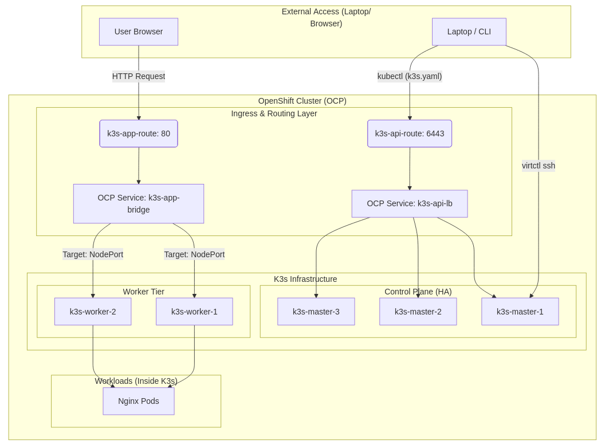

## K3s-as-a-Service (K3aaS) via OpenShift Pipelines

"The 'K3s-as-a-Service (K3aaS)' project delivers a fully automated, self-service platform for deploying nested Kubernetes clusters directly on top of OpenShift. Powered by OpenShift Pipelines (Tekton) and KubeVirt, this framework enables the dynamic provisioning of K3s environments where cluster sizing is driven **by user-defined parameters** rather than static configurations.

The architecture features a high-availability 3-master control plane and a scalable worker tier, seamlessly bridged to the outside world through OpenShift Routes and Services. This integration allows for external kubectl management and direct browser access to virtualized workloads via the OpenShift Ingress layer. While providing a robust sandbox for multi-cluster networking, isolation, and CI/CD experimentation, this project is a Proof of Concept (PoC) and is not intended for production-ready environments. It stands as a sophisticated 'Kubernetes-on-Kubernetes' solution for on-demand infrastructure scaling."

## Architecture  

